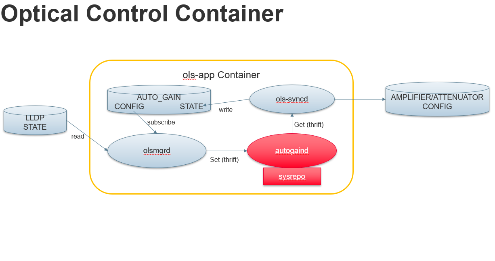

# Open Line System (OLS) Application Container
This container includes applications that perform optical control logic. 
## Auto-Gain Process
Auto-Gain automatically configures Amplifiers in a PtoP DWDM Connection based on configuration in AUTO_GAIN table. It is integrated as a third party application (debs package) into sonic. The integration is shown in the following diagram.

## New apps can be added
Other optical applications can be added into this container.