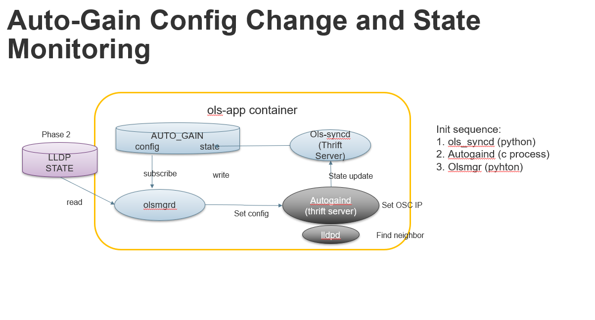
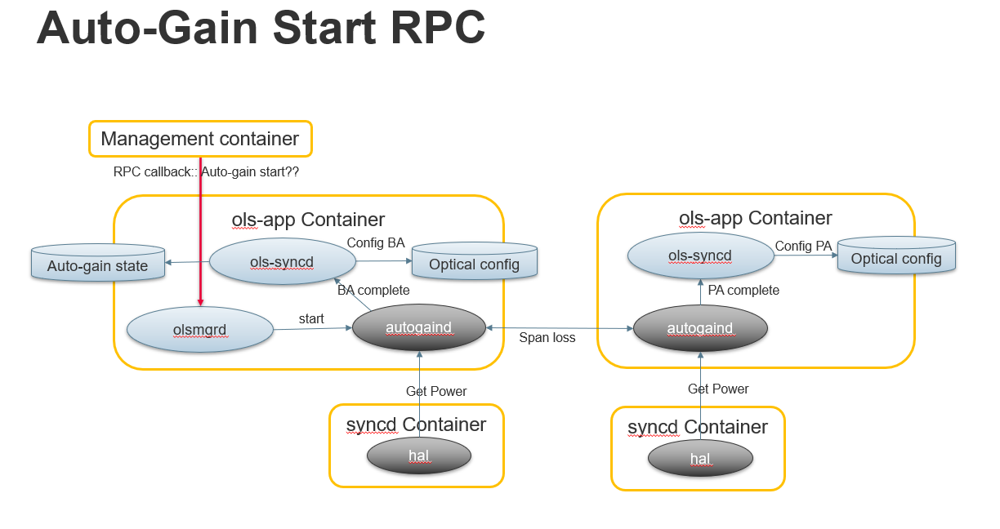

# Open Line System (OLS) Application Container
This container includes applications that perform optical control logic. 
## Auto-Gain Process
Auto-Gain automatically configures Amplifiers in a PtoP DWDM Connection based on configuration in AUTO_GAIN table. It is integrated as a third party application (debs package) into sonic. The integration is shown in the following diagram.

### Architecture

- olsmgrd is python daemon that subscribe the AUTO_GAIN config change and update to the auotgaind as Thrift client.
- ols_syncd is a pyhton daemon receives the status from autogaind as Thrift server and update the AUTO_GAIN state DB.
- ols_syncd also recieved two notifications (BA done and PA done) from autogaind and set the AMPLIFIER and ATTENUATOR in config DB

### Auto-gain RPC control flow

- Management framework receive start auto-gain rpc request and send it to olsmgr (TODO: How?)
- olsmgr send the start request to autogaind via thrift RPC
- When autogaind (egress) finish the BA control, it send RPC to ols_syncd which will update the BA and Padding VOA config
- When autogaind (ingress) complete the PA control algorithm, it send RPC to notify the ols_sync which again update the PA and PA-VOA config.

## New apps can be added
Other optical applications can be added into this container.